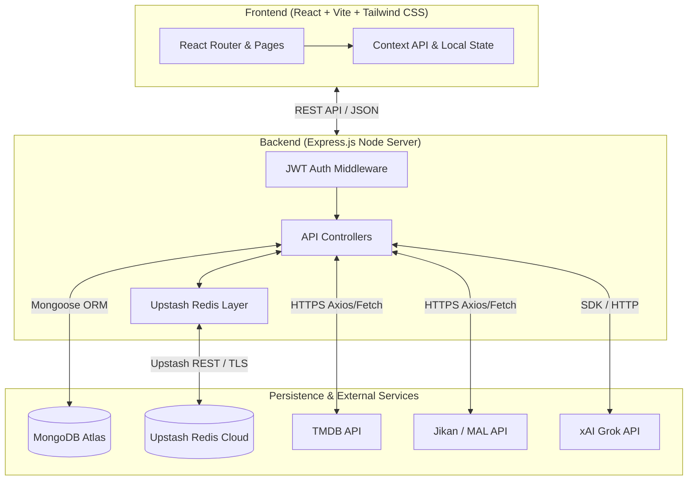
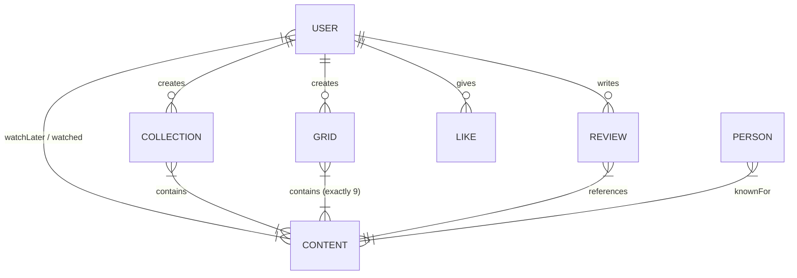
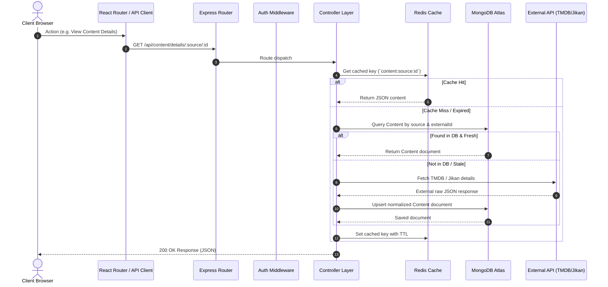

# Cinefy - Full-Stack Entertainment Discovery & Social Platform

Cinefy is a modern, full-stack web application designed for discovering, tracking, and curating movies, TV shows, and anime. It unifies data from external media APIs (TMDB and Jikan) into a single performant database with multi-layer caching, custom 3x3 favorite grids, community collections, AI-assisted recommendations (powered by xAI Grok), and personalized user watchlists.

---

## Architecture Overview

Cinefy follows a decoupled client-server architecture built on the MERN stack (MongoDB, Express.js, React, Node.js) supplemented by Upstash Redis caching and xAI Grok integration.



### High-Level Architecture & Implementation Principles
1. **Lazy Caching & Normalization Pipeline**: Requests for external content (TMDB movies/TV or Jikan anime) first check Redis/MongoDB. If absent or stale (`lastFetched`), the server fetches external data, maps it into Cinefy's unified `Content` model schema, saves it to MongoDB, and serves the response.
2. **Multi-Tier Caching**: High-throughput endpoints (e.g. trending content, top-rated lists, ongoing daily menus) use Upstash Redis key-value caching with TTLs to minimize external API rate limits and reduce latency.
3. **Decoupled Client & Micro-Interactions**: The SPA frontend uses Tailwind CSS v4, custom glassmorphism design tokens, Lucide React icons, and React Router v7.

---

## Data Models & Database Schema



### 1. User (`User.js`)
Represents registered users on the platform.

| Field | Type | Attributes | Description |
| :--- | :--- | :--- | :--- |
| `_id` | ObjectId | Primary Key | Auto-generated MongoDB identifier |
| `username` | String | Required | Display name of the user |
| `email` | String | Required, Unique | Unique email address used for login |
| `password` | String | Required | Salted and hashed password string (via `bcryptjs`) |
| `profilePic` | String | Optional | Base64 encoded or external URL image reference |
| `watchLater` | Array[ObjectId] | Ref: `Content` | References to content items saved for future watching |
| `watched` | Array[ObjectId] | Ref: `Content` | References to content items completed by the user |
| `createdAt` / `updatedAt` | Date | Timestamps | Automatic Schema timestamps |

### 2. Content (`Content.js`)
Normalized repository model unifying external movie, TV show, and anime records.

| Field | Type | Attributes | Description |
| :--- | :--- | :--- | :--- |
| `_id` | ObjectId | Primary Key | Auto-generated identifier |
| `source` | String | Enum: `["tmdb", "jikan"]` | Source data provider |
| `externalId` | String | Required | ID from external provider (TMDB ID or MAL ID) |
| `type` | String | Enum: `["movie", "tv", "anime"]` | Media classification |
| `title` | String | Required | Title of the movie, show, or anime |
| `poster` | String | Optional | Poster image URL |
| `backdrop` | String | Optional | Wide banner image URL |
| `description` | String | Optional | Synopsis / Plot overview |
| `genres` | Array[String] | Optional | Array of genre tags |
| `mood` | Array[String] | Optional | AI-tagged emotional themes |
| `releaseDate` | Date | Optional | Release or premiere date |
| `rating` | Number | Optional | Global rating score |
| `popularity` | Number | Optional | Popularity index |
| `language` | Array[String] | Optional | Spoken languages |
| `country` | String | Optional | Country of origin |
| `ageRating` | String | Optional | Content classification (e.g. PG-13, TV-MA) |
| `trailer` | String | Optional | YouTube trailer URL |
| `platforms` | Array[String] | Optional | Streaming availability tags |
| `cast` | Array[Object] | Embedded | Array of `{ externalId, name, profilePic }` |
| `crew` | Array[Object] | Embedded | Array of `{ externalId, name, role }` |
| `isOngoing` | Boolean | Default: `false` | True if content is currently airing |
| `lastFetched` | Date | Default: `Date.now` | Cache staleness tracking timestamp |

*Indexes*: 
- Compound Unique Index: `{ source: 1, externalId: 1 }`
- Text Index: `{ title: "text" }`

### 3. Review (`Review.js`)
User reviews and rating scores for specific content items.

| Field | Type | Attributes | Description |
| :--- | :--- | :--- | :--- |
| `userId` | ObjectId | Ref: `User`, Required | Review author |
| `contentId` | ObjectId | Ref: `Content`, Required | Target content item |
| `worthScore` | Number | Min: 1, Max: 10 | Numeric rating score |
| `comment` | String | Maxlength: 200 | Written review text |
| `cenifyMeter` | String (Virtual) | Computed | Virtual property: `≤4: "Waste"`, `5-7: "Okay"`, `8-10: "Must Watch"` |

*Indexes*: 
- Compound Unique Index: `{ userId: 1, contentId: 1 }` (Ensures one review per user per content)

### 4. Collection (`Collection.js`)
Custom user-curated playlists of content.

| Field | Type | Attributes | Description |
| :--- | :--- | :--- | :--- |
| `userId` | ObjectId | Ref: `User`, Required | Creator of the collection |
| `title` | String | Required | Collection name |
| `description` | String | Optional | Overview of the curated list |
| `items` | Array[ObjectId] | Ref: `Content` | Contained content items |
| `likesCount` | Number | Default: `0` | Denormalized count of community likes |
| `isPrivate` | Boolean | Default: `false` | Visibility flag |

### 5. Grid (`Grid.js`)
Custom 3x3 matrix layout representing a user's top 9 favorite titles.

| Field | Type | Attributes | Description |
| :--- | :--- | :--- | :--- |
| `userId` | ObjectId | Ref: `User`, Required | Grid owner |
| `title` | String | Required | Title of the 3x3 grid |
| `items` | Array[ObjectId] | Ref: `Content`, Validate | Array of exactly 9 `Content` ObjectIds |
| `likesCount` | Number | Default: `0` | Denormalized count of community likes |

### 6. Like (`Like.js`)
Social interaction record tracking user likes on grids and collections.

| Field | Type | Attributes | Description |
| :--- | :--- | :--- | :--- |
| `userId` | ObjectId | Ref: `User`, Required | User who liked the target |
| `targetType` | String | Enum: `["grid", "collection"]` | Target entity type |
| `targetId` | ObjectId | Required | Target entity ObjectId |

*Indexes*: 
- Compound Unique Index: `{ userId: 1, targetId: 1 }`

### 7. Person (`Person.js`)
Entity model for actors, directors, voice cast, and staff members.

| Field | Type | Attributes | Description |
| :--- | :--- | :--- | :--- |
| `source` | String | Enum: `["tmdb", "jikan"]` | Source provider |
| `externalId` | String | Required | External ID from TMDB/Jikan |
| `name` | String | Required | Person's full name |
| `profilePic` | String | Optional | Headshot image URL |
| `bio` | String | Optional | Biography text |
| `knownFor` | Array[ObjectId] | Ref: `Content` | Populated content references |
| `knownForItems` | Array[Object] | Embedded | Backup structural items `{ externalId, type, title }` |

---

## Project Structure

```
Cinefy/
├── backend/
│   ├── config/             # Environment setup & configuration helpers
│   ├── controllers/        # Request handling & business logic execution
│   │   ├── authController.js
│   │   ├── collectionController.js
│   │   ├── contentController.js
│   │   ├── gridController.js
│   │   ├── personController.js
│   │   ├── reviewController.js
│   │   └── userController.js
│   ├── middleware/         # Express custom middleware (JWT auth)
│   │   └── authMiddleware.js
│   ├── models/             # Mongoose schemas and indexes
│   ├── routes/             # REST API routing definitions
│   ├── redisClient.js      # Upstash Redis client connection wrapper
│   └── server.js           # Main Express server entry point
└── frontend/
    ├── public/             # Static web assets and icons
    ├── src/
    │   ├── api.js          # Centralized environment API client wrapper
    │   ├── components/     # Reusable UI elements (Layout, AuthModal, ToastContext)
    │   ├── pages/          # Application views (Home, ContentDetails, Genres, Grids, etc.)
    │   ├── App.jsx         # App routes & provider configuration
    │   ├── index.css       # Tailwind CSS directives & custom design system tokens
    │   └── main.jsx        # React root DOM renderer
    ├── index.html          # Main HTML entry point
    └── vite.config.js      # Vite build configuration
```

---

## Request Lifecycle & Data Flow



---

## Authentication & Security Mechanisms

- **Authentication Strategy**: JSON Web Tokens (JWT). Upon successful login or registration via `/api/auth/login` or `/api/auth/register`, a signed JWT is returned to the client and stored in `localStorage`.
- **Authorization Middleware**: Requests to protected endpoints (e.g. toggling watch lists, submitting reviews, creating collections or 3x3 grids) pass through `authMiddleware.js`. It verifies the `Authorization: Bearer <token>` header and attaches `req.user = { id }` to downstream handlers.
- **Password Hashing**: User credentials are encrypted using `bcryptjs` with salt rounds prior to persistence.
- **CORS Protection**: Express backend implements explicit origin whitelist validation supporting dynamic local development ports and live client deployment domains (`CLIENT_URL`).

---

## Services & External Integrations

1. **TMDB API (The Movie Database)**: Primary source for movie and TV show data, metadata, trending lists, posters, backdrops, cast/crew details, and trailers.
2. **Jikan API**: Open-source REST API for MyAnimeList (MAL), providing anime rankings, seasonal releases, and character details.
3. **xAI Grok Integration**: Integrated inside `contentController.js` to dynamically generate mood tags, natural language summaries, and recommendations.
4. **Upstash Redis**: Serverless cloud Redis instance used for caching responses from high-traffic endpoints to prevent hitting external API rate limits.

---

## Environment Variables & Configuration

### Backend Environment Variables (`backend/.env`)

```env
PORT=5000
MONGO_URI=mongodb+srv://<user>:<password>@cluster0.mongodb.net/cinefy?retryWrites=true&w=majority
REDIS_URL=rediss://default:<password>@<upstash-host>:<port>
JWT_SECRET=your_super_secret_jwt_key
CLIENT_URL=https://ani-cinefy.vercel.app
GROK_API_KEY=your_xai_grok_api_key_optional
```

### Frontend Environment Variables (`frontend/.env`)

```env
VITE_API_URL=http://localhost:5000/api
```

### Frontend Production Environment Variables (`frontend/.env.production`)

```env
VITE_API_URL=https://cinefy-backend-uhir.onrender.com/api
```

---

## Local Setup & Development Commands

### Prerequisites
- **Node.js**: v18.x or higher
- **npm**: v9.x or higher
- **MongoDB**: Active connection string (Atlas or local instance)

### Installation

1. **Clone the repository**:
   ```bash
   git clone https://github.com/Aniketghosh2003/Cinefy.git
   cd Cinefy
   ```

2. **Install Backend Dependencies**:
   ```bash
   cd backend
   npm install
   ```

3. **Install Frontend Dependencies**:
   ```bash
   cd ../frontend
   npm install
   ```

### Running Locally

1. **Start the Backend Server**:
   ```bash
   cd backend
   npm run start
   ```
   *The backend will run on `http://localhost:5000`.*

2. **Start the Frontend Development Server**:
   ```bash
   cd frontend
   npm run dev
   ```
   *The frontend will run on `http://localhost:5173`.*

---

## Deployment Instructions

### 1. Backend (Render / Cloud Host)
- Root Directory: `backend`
- Build Command: `npm install`
- Start Command: `npm start`
- Add environment variables (`MONGO_URI`, `REDIS_URL`, `JWT_SECRET`, `CLIENT_URL`).

### 2. Frontend (Vercel / Netlify)
- Framework Preset: `Vite`
- Root Directory: `frontend`
- Build Command: `npm run build`
- Output Directory: `dist`
- Add environment variable (`VITE_API_URL=https://your-backend-service.onrender.com/api`).

### 3. Server Keep-Alive (UptimeRobot)
- To prevent free host instances (e.g. Render) from spinning down after inactivity, set an HTTP ping monitor pointing to `https://your-backend.onrender.com/api/content/trending` every 5–10 minutes.

---

## Special Thanks

Special thanks to **moctale.in** for the inspiration behind this project. Their ideas and approach served as valuable inspiration during the design and development process.
